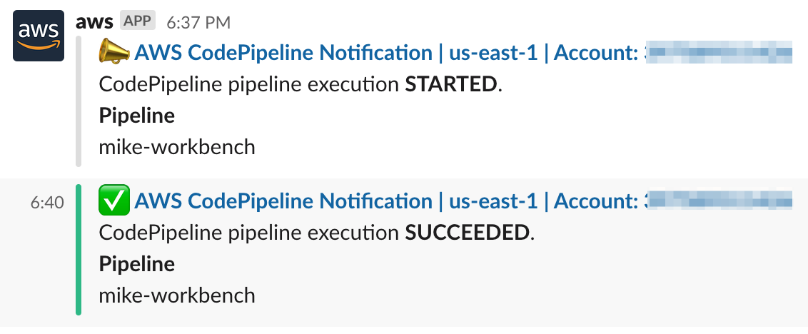

# CodePipeline Chatbot Notifier

An AWS SAR component that sends CodePipeline notifications to [AWS Chatbot](https://aws.amazon.com/chatbot/), which itself can publish messages to Slack, etc.



You'll need to deploy this once per CodePipeline you wish to receive notitications for.

If you want to integrate Chatbot with CodeBuild instead then please see the [CodeBuild version of this component](https://github.com/symphoniacloud/codebuild-chatbot).

## Usage

### Deploying using CloudFormation 

If you deploy your CodePipeline infrastructure using CloudFormation, then you can include the *Chatbot Notifier* SAR component in the same template as your CodePipeline. First, make sure you've included the SAM transform in your CloudFormation template - we normally put it as the second line:

```yaml
Transform: AWS::Serverless-2016-10-31
```

Next, in the `Resources` section of your template, add a SAR resource as follows:

```yaml
  ChatbotNotifier:
    Type: AWS::Serverless::Application
    Properties:
      Location:
        ApplicationId: arn:aws:serverlessrepo:us-east-1:073101298092:applications/codepipeline-chatbot
        SemanticVersion: 1.0.1
      Parameters:
        CodePipeline: 'YOUR_CODEPIPELINE_NAME'
```

This SAR has one **required** parameter: `CodePipeline` . Typically you'll set this to `!Ref YOUR_CODEPIPELINE_RESOURCE` (**not** quoted inside a string!), where `YOUR_CODEPIPELINE_RESOURCE` is the logical resource name of the `AWS::CodePipeline::Pipeline` resource that is also in this CloudFormation template.

#### Example

For an example of configuring *Chatbot Notifier* with CloudFormation, see the **`ChatbotNotifier`** resource in [this template](https://github.com/symphoniacloud/codepipeline-versioner/blob/master/publish/pipeline.yaml).

### Deploying without CloudFormation

If you want to deploy without CloudFormation you can do so from the Serverless Application Repository browser [here](https://serverlessrepo.aws.amazon.com/applications/arn:aws:serverlessrepo:us-east-1:073101298092:applications~codepipeline-chatbot).

### Setting up Chatbot

This SAR app doesn't actually publish notifications to Slack, etc., it merely puts them in a place AWS Chatbot can use them. Therefore to publish the actual notifications to Slack see the [AWS Chatbot documentation](https://docs.aws.amazon.com/chatbot/latest/adminguide/index.html). You'll need to know the SNS topic name to connect to Chatbot - that's available in the `SNSTopicName` CloudFormation Output value of the SAR component.

## Advanced usage

### Configuration

Apart from the required `CodePipeline` parameter, there are other optional parameters to the resource. Here's the full list of parameters.

| Name          | Required | Default           | Description  |
| ------------- |:--------:|:-----------------:| -----|
| `CodePipeline` | Yes | n/a | The name of the CodePipeline to capture notifications from. Equal to the "Ref" value of the `AWS::CodePipeline::Pipeline` resource. |
| `NotificationRuleName` | No | Same value as `CodePipeline` | Set if you wish to override the name given to the [CodeStar Notification Rule](https://docs.aws.amazon.com/codestar-notifications/latest/userguide/notification-rules.html) - this is necessary if the `CodePipeline` argument is longer than 64 characters. |
| `DetailType` | No | FULL | The level of detail to include in the notifications for this resource. (see [AWS documentation](https://docs.aws.amazon.com/AWSCloudFormation/latest/UserGuide/aws-resource-codestarnotifications-notificationrule.html)). |

### Further customization

If you'd like further customization, e.g. changing the name of the SNS topic or customizing which events are published, then I recommend replacing the SAR with the plain resources in the SAR's source template (see [here](https://github.com/symphoniacloud/codepipline-chatbot/blob/master/template.yaml)) - the SAR has no Lambda components, just plain CloudFormation resources which you can drop  into a regular CloudFormation template.

## Final comment

This component supersedes my previous SAR app [Code Pipeline Slack Notifier](https://github.com/symphoniacloud/code-pipeline-slack-notifier), which is no longer maintained, and deprecated.
